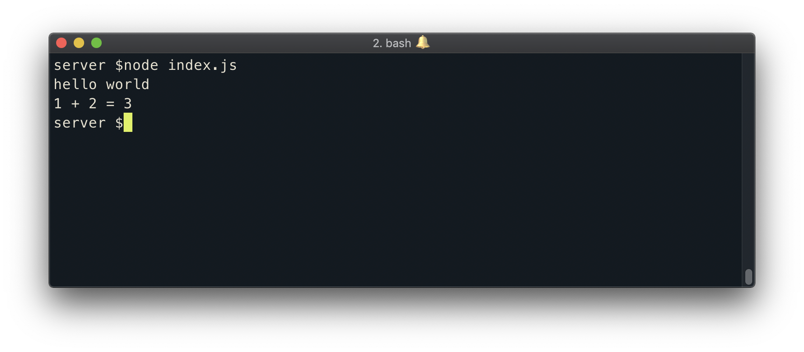

> This is an example lesson of how to load code from disk

Here's how to load code by specific line numbers:

{lang=javascript,line-numbers=off,crop-start-line=1,crop-end-line=1}
<<[server/index.js](./protected/src/index.js)

Here's how to load code by a query:

{lang=javascript,line-numbers=off,crop-query=.sayHello}
<<[server/index.js](./protected/src/index.js)

Here's the whole file:

{lang=javascript,line-numbers=off}
<<[server/index.js](./protected/src/index.js)

We can also just have embedded code blocks:

```shell
server $: node server/index.js
```

By running the above command, we can see the two `console.log` messages we've prepared!


