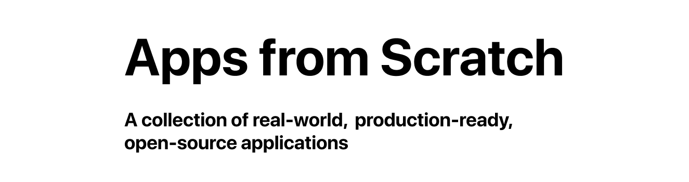

# 

### Come chat with the community - [join our Discord!](https://discord.gg/hSx4STBfgB)

[](https://discord.gg/hSx4STBfgB) [](https://twitter.com/fullstackio)


## What is Apps from Scratch?

- Apps from Scratch is a community effort to build a set of production-ready, open-source apps inspired by popular companies - but implemented across many combinations of frameworks.
- It includes code, UI guidelines, tests, and even deployment scripts.

## Get involved!
Anyone can contribute to Apps from Scratch, just review the Contribution Guidelines and ...

## Why do this?

While there are plenty of "toy" apps on Github, there aren't many that show end-to-end, production applications. _Apps from Scratch_ fixes that by showing 

## What projects are similar?

In particular, we're inspired by Todo MVC and Realworld and we see _Apps from Scratch_ as a continuation of that idea: show the same app implemented in a variety of frameworks 

## Installation

```
yarn
yarn start
```
